# WeatherStationOnTheDesk 桌面级气象站

### 打印外壳

打印两个模型，作为气象站的外壳。

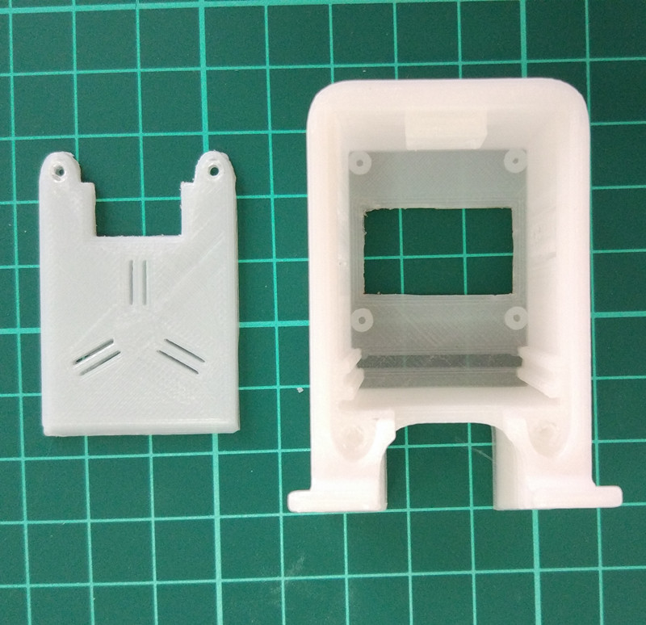

Station_Box_Plate.stl

Station_Box_with_Button_Hole.stl

### 程序思路

* 利用Blynk做程序框架

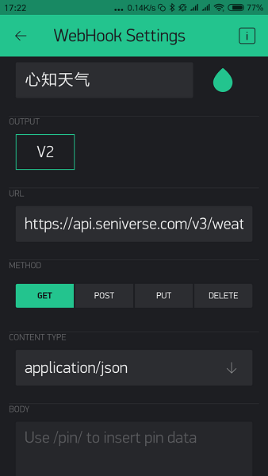

* 从Blynk获取时间

* 读取DHT11温湿度值

* 从心知天气获取气象信息

### 组装

电路图

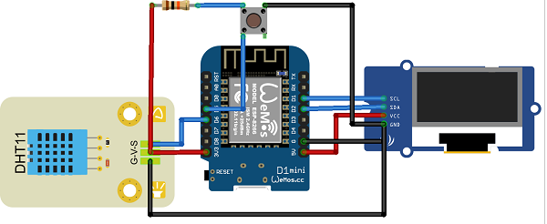

实物连接图

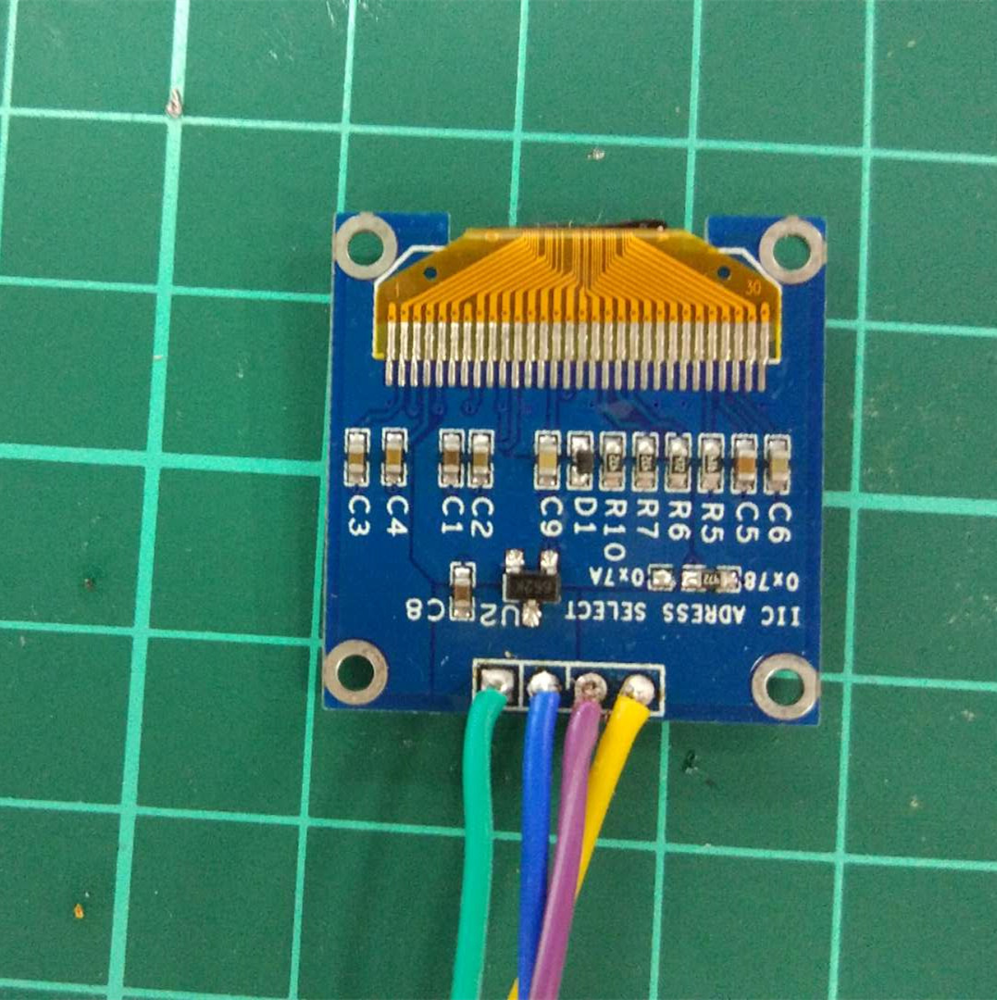

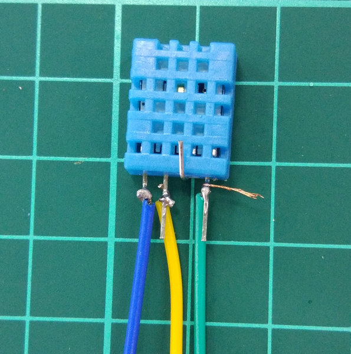

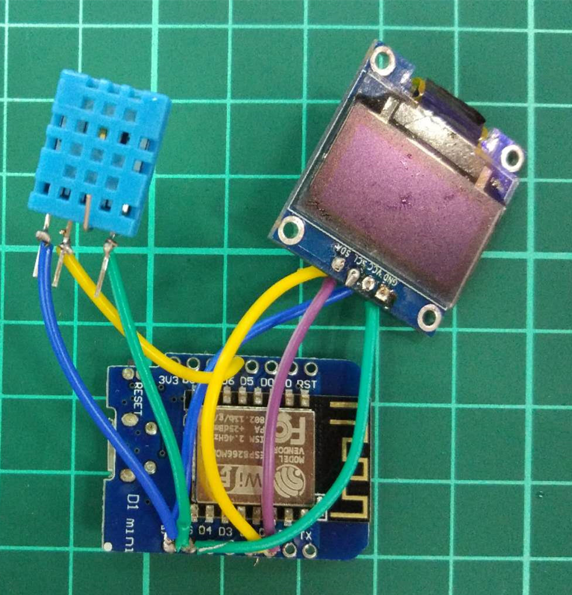

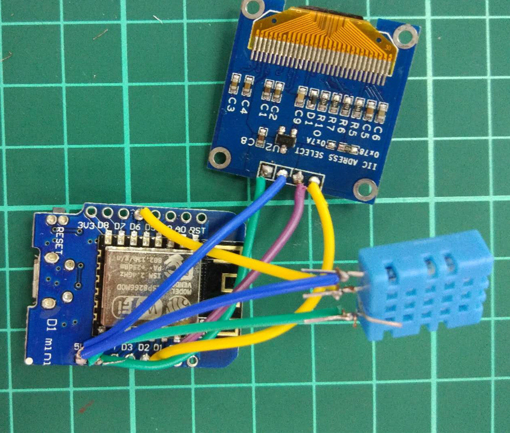

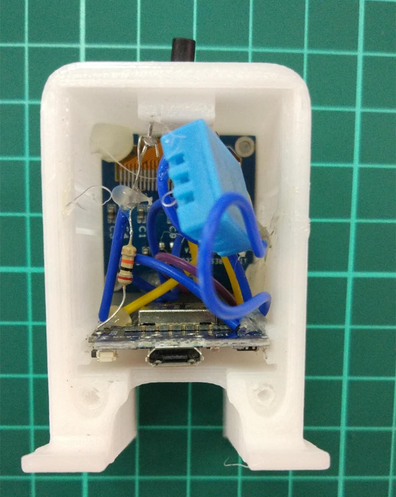

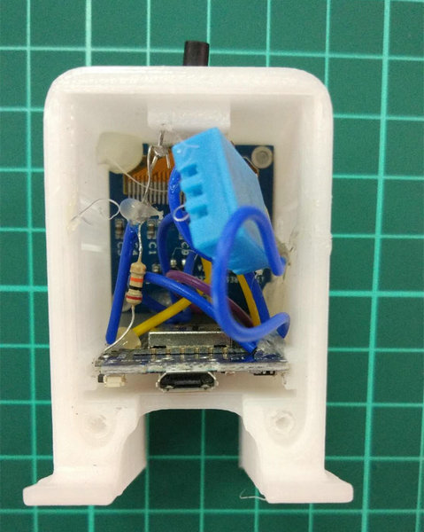

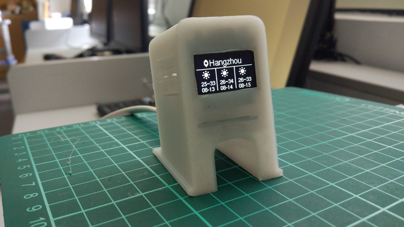

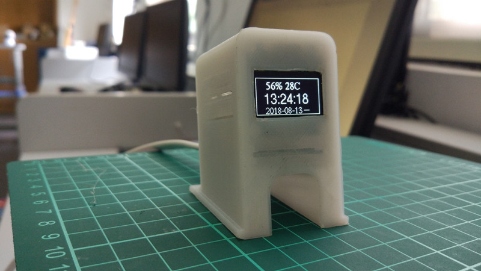